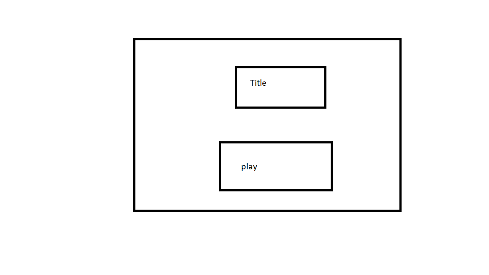
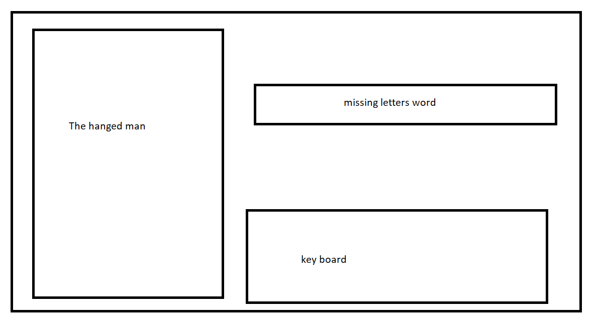

# Terminator-Preventer

# Description

This is a hanged man style game with a Terminator theme

# Wireframes

# Pseudo-code

0. page loads
1. Player will open the game by pressing play.
2. once the inital code loads the player can start.
3. the player will use the ingame keyboard to guess the word.
4. if the player guesses a letter wrong the hanged man is drawn bit by bit.
5. if the player guesses correctly the letter he picked will apear on the missing spaces.
6. if the word is guessed correctly he wins.
7. if the hanged man has been drawn fully the player loses.
8. when the round is complete the player can choose to try another word.
9. the player can return to the loading screen by pressing (return to loading screen).
